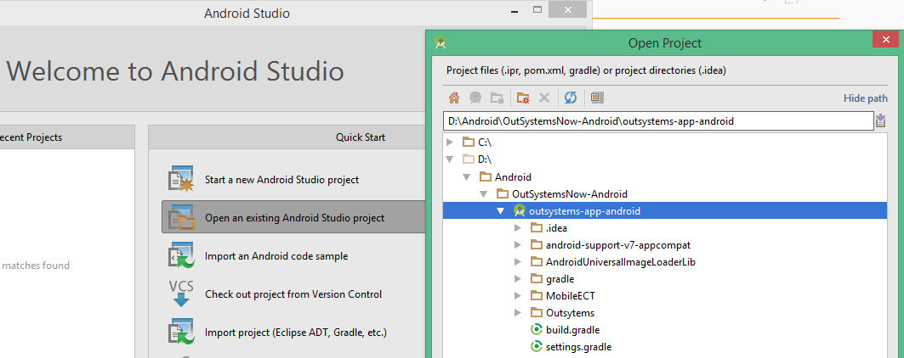
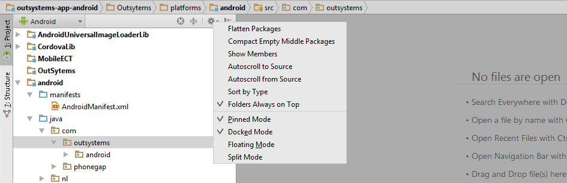
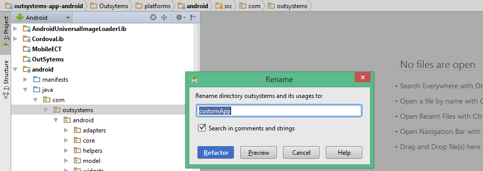
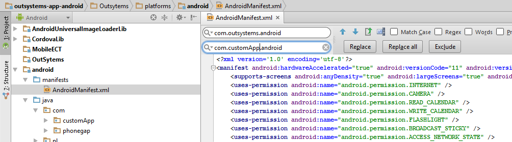
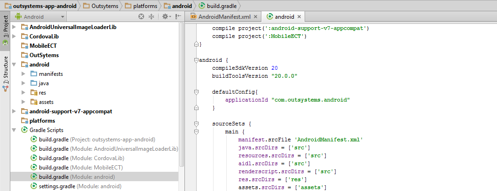
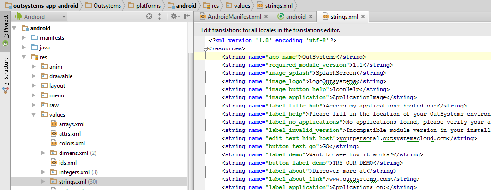
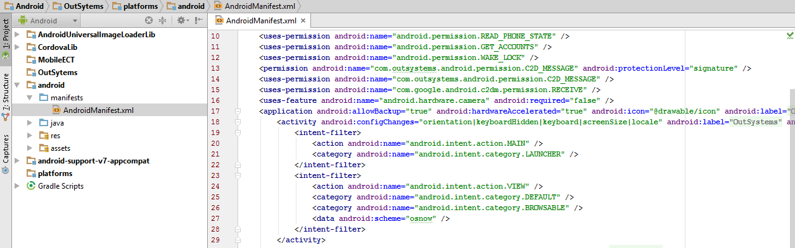

# OutSystems Now (Android)

This is the open source code for the old version of OutSystems Now.
This version brings your OutSystems experience to your mobile device, providing a fast way to access all your applications including CRM, Customer Portal, or any other custom app built with the OutSystems Platform.

Note that this is a **deprecated version of OutSystems Now and is no longer supported** by OutSystems. You can find more details on the [OutSystems Now website](https://now.outsystems.com).

The source code is made available for you to create your own version of the application.

This way you can apply your own branding such as the application name, logo and splash screens.

You can also have control over push notifications and enhance your business with a true mobile experience.

## Requirements

You will require an Android development environment (for instance, Android Studio) and a Google developer license. You can submit the application to Google Play if it complies with the store guidelines. **The newly created application will be under your responsibility and should be supported by you**.

## Steps for building your own customized OutSystems Now

### 1. Get the source code

You can clone (or fork) the repository or just download it as a zip file to have a local copy.

### 2. Setup your development environment

Download and install [Android Studio](http://developer.android.com/sdk/index.html) in your computer. After installing it, open the Android SDK Manager to check that you have installed the following packages:

* **Android SDK Tools 25.1.6**
* **Android SDK Platform-tools 23.1**
* **Android SDK Build-tools 23.0.3**
* **Android SDK Build-tools 20**
* **Android 4.4W.2 SDK Platform**
* **Android 4.4.2 SDK Platform**
* **Android Support Repository**
* **Android Support Library**
* **Google Repository**
* **Google USB Driver**
* **Intel x86 Emulator Accelerator**

In Android Studio, open your project using the **Open an existing Android Studio project** option and choose the **outsystems-app-android** folder.

If you also wish to submit the application to Google Play, you will also need a [Google Play Developer account](https://play.google.com/apps/publish/signup).

### 3.  Customize your OutSystems Now

Open the GitHub source code in your development environment and you are ready to start building your own version of the application. 
To learn more about the Android development you can check the complete list for tutorials available online in the [Developer Guide](https://developer.android.com/training/index.html).

#### Change the application name and package id

You need to change the **package identifier**. You will not be able to upload your application on the store if there is already another application using the same identifier. To change the package identifier, follow the next instructions:

* In the Project pane in Android Studio, click on the gear icon and uncheck the Flatten Packages and Compact Empty Middle Packages options.

  

* Individually select each directory you want to rename, and:

  * Right-click it > select **Refactor** > click on **Rename**
  * In the Pop-up dialog, click on **Rename Package** instead of Rename Directory
  * Enter the new name and hit **Refactor**
  * Allow a minute to let Android Studio update all changes

  

* Now open your **ApplicationManifest.xml** file, and change the package name to the new name

  > Note: We recommend you to search and replace the old name with the new name. This will avoid conflicts with the original OutSystems Now app when you install your custom app on a device.

  

* Finally, open your **build.gradle** file (Module: android) and update the **applicationId** to your new Package Name and Sync Gradle

  

  The current application name can be found along with multiple other configurations in the strings.xml file, which you can find under the OutSystems\res\values folder in the Package Explorer. Double click to open the file and choose the strings.xml view (last tab below the file content view), which allows you to view and edit the raw XML content. There you will find an entry for **app_name**, which you can change to your application name.

  

#### Replace the application logo and splash screens

Under the Package Explorer, you can find the application **logo** (icon.png) inside the following folders: drawable-mdpi, drawable-hdpi and drawable-xhdpi. You can find all these folders under the OutSystems > res folder. Replace those files with the logo image that you wish to use, respecting the image dimensions.
For the splash screen, you will find several bg_red.jpg files used for the different splash screens in the OutSystems > res folder. These files are used as background images. For the foreground logo, you can also find the logo.png file, which you should update to your own brand file. The logo.png file is available inside the following folders: drawable-ldpi, drawable-mdpi, drawable-hdpi, drawable-xhdpi and drawable-sw600dp. If you need help creating application icons and splash screen, there are several websites, such as [TiCons](http://ticons.fokkezb.nl/), that generate all the necessary files needed.

#### Enable Google Cloud Messaging on your application

To push notifications we suggest that you use a third party service such as [Pushwoosh](http://www.pushwoosh.com/) or [UrbanShip](http://urbanairship.com/) (paid services).  These services simplify the whole process of pushing notifications and, better yet, they provide a single way of doing it for iOS, Android and Windows. No need to develop custom push mechanisms for each vendor. There are several other companies offering the same services and you can work with any of those if you wish. Most of them are paid services, so a subscription fee may be necessary.

To learn more about Push Notifications, check out the online information available at [Google Cloud Messaging for Android](https://developer.android.com/google/gcm/index.html).

#### Enable Deep Linking on your application

To enable the deep linking feature on your own application, you need to change the Application Protocol. In the Project panel, open your ApplicationManifest.xml file under the Android project, and search for the android:scheme. Replace the current application protocol with your own protocol. We recommend you to use lowercase.

  

### 4. Publishing to the store

Once you have your own version of the OutSystems Now app, you can distribute it. Learn how you can do it with the [Get Started with Publishing](http://developer.android.com/distribute/googleplay/start.html) guide for Android.